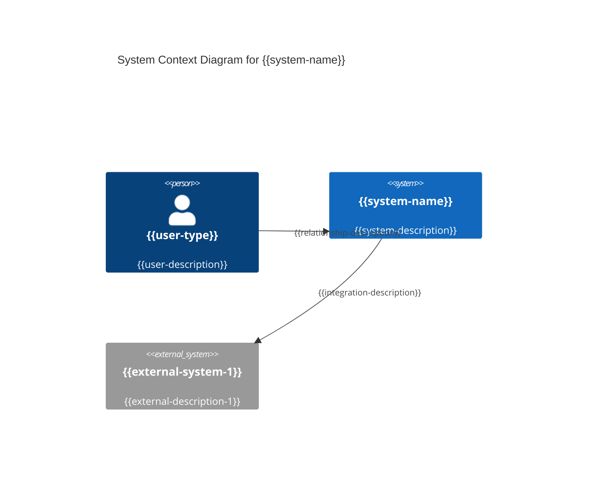
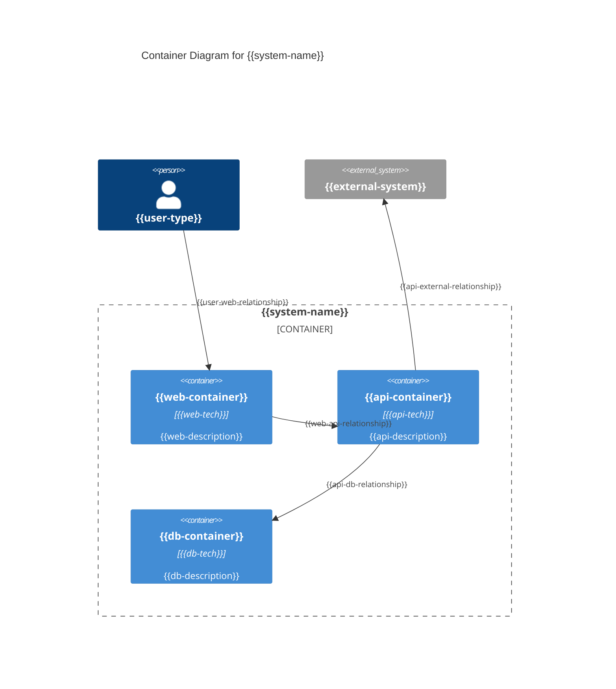
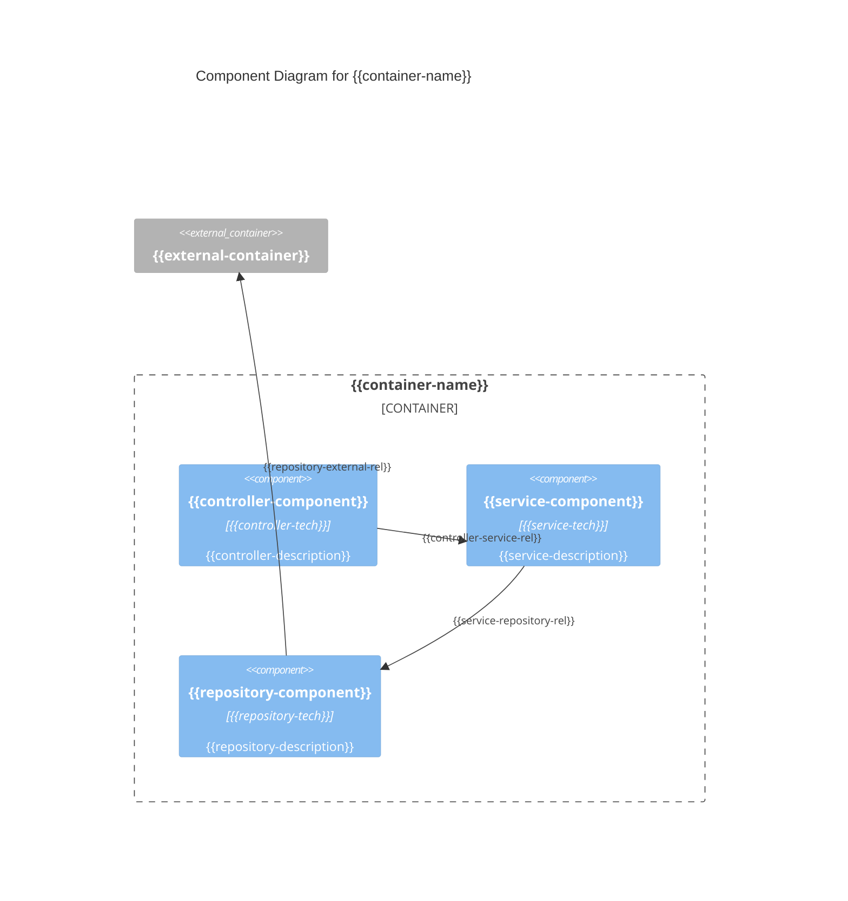
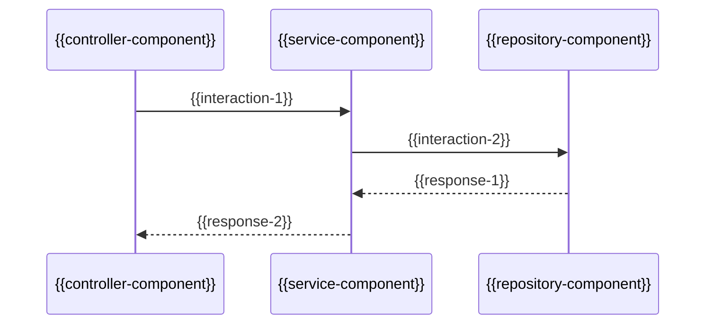

# Claude Code: Key Concepts and Implementation Guide

## Overview of Claude Code Architecture

Claude Code is Anthropic's agentic command-line tool that transforms natural language instructions into executable development tasks. It operates as a specialized AI agent with direct file system access and integrates with external tools through the Model Context Protocol (MCP), sharing configuration architecture with Claude Desktop.

## Key Concepts in Claude Code

### 1. Agent Configuration

**Configuration File Location:**
- **macOS**: `~/Library/Application Support/Claude/claude_desktop_config.json`
- **Windows**: `%APPDATA%\Claude\claude_desktop_config.json`
- **Linux**: `~/.config/Claude/claude_desktop_config.json`

**Note**: Claude Code shares the same configuration file with Claude Desktop, enabling unified MCP server management across both tools.

**Configuration Management:**
```bash
# Add MCP servers via CLI (recommended)
claude mcp add obsidian-mcp -- npx mcp-obsidian ~/Documents/MyVault

# Add with specific scope
claude mcp add obsidian-mcp -s user -- npx mcp-obsidian ~/Documents/MyVault
claude mcp add project-tools -s project -- npx project-mcp-server

# Add JSON configuration directly
claude mcp add-json obsidian '{"command":"npx","args":["mcp-obsidian","/path/to/vault"]}'

# List configured servers
claude mcp list

# Remove a server
claude mcp remove obsidian-mcp
```

**Configuration Structure:**
```json
{
  "mcpServers": {
    "obsidian": {
      "command": "npx",
      "args": ["mcp-obsidian", "/Users/username/Documents/Vault"],
      "env": {
        "NODE_ENV": "production"
      }
    },
    "github": {
      "command": "npx",
      "args": ["-y", "@modelcontextprotocol/server-github"],
      "env": {
        "GITHUB_PERSONAL_ACCESS_TOKEN": "ghp_your_token_here"
      }
    },
    "filesystem": {
      "command": "npx",
      "args": ["-y", "@modelcontextprotocol/server-filesystem", "/path/to/allowed/directory"]
    }
  }
}
```

**Configuration Scopes:**

1. **User Scope (`-s user`)**: Global configuration available to all projects
   - Stored in main config file
   - Accessible across all Claude Code sessions
   
2. **Project Scope (`-s project`)**: Project-specific configuration
   - Stored in `.mcp.json` in project root
   - Version-controlled and shared with team
   - Requires approval when first detected

**Project Configuration (`.mcp.json`):**
```json
{
  "mcpServers": {
    "project-docs": {
      "command": "npx",
      "args": ["documentation-mcp", "./docs"],
      "env": {}
    }
  }
}
```

### 2. Context Management

**How Agents Receive Context:**

Claude Code has **no built-in configuration for default context**. All context must be explicitly provided via command-line flags for each invocation.

**Context Provision Methods:**
```bash
# Include specific files
claude-code --context README.md --context docs/api.md "Update the API documentation"

# Include entire directories  
claude-code --context src/ --context tests/ "Refactor the user authentication module"

# Include multiple context sources
claude-code --context ./ --context ~/dev/ai-dotfiles/knowledge/ "Implement the user story following our guidelines"

# Context from URLs (if web access available)
claude-code --context https://docs.example.com/api "Review this API documentation and suggest improvements"
```

**Dynamic Context (via MCP Tools):**
```bash
# Context retrieved automatically through MCP servers
claude-code "Review my journal entries from last week and summarize key insights"
# Agent automatically uses Obsidian MCP to fetch recent journal entries

claude-code "Create a PR for the feature I've been working on"
# Agent uses GitHub MCP to access repository context
```

**Context Limitations:**
- No persistent context between command invocations
- No configuration file for default context paths
- Each `claude-code` execution starts fresh
- Context must be explicitly specified each time

### 3. Memory Architecture

**Session Memory:**
- Claude Code maintains conversation context **only within a single command execution**
- Multiple interactions within one command accumulate context
- Rich conversation history during task execution

**Cross-Session Memory:**
- **No persistent memory** between different `claude-code` command invocations
- Each command starts completely fresh
- No memory of previous conversations, decisions, or state

**Memory Patterns:**
```bash
# Single session with accumulated context (WORKS)
claude-code "Create a note about John Doe. Now create a meeting note referencing John. List all notes about John."

# Separate sessions (NO MEMORY between them)
claude-code "Create a note about John Doe"
claude-code "List all notes about John"  # Won't remember the previous creation
```

**Workarounds for Persistence:**
```bash
# Use project files to maintain state
claude-code "Save the current project context to .claude-state.json"
claude-code --context .claude-state.json "Continue from where we left off"

# Use MCP servers as external memory
claude-code "Document this decision in our team wiki"
claude-code "What decisions have we made about the authentication system?"
```

### 4. MCP Server Integration

**MCP Server Lifecycle:**
1. **Initialization**: Servers start when Claude Code begins execution
2. **Tool Discovery**: Agent automatically discovers available tools from each configured server
3. **Tool Execution**: Agent calls tools as needed during task execution
4. **Cleanup**: Servers terminate when Claude Code finishes

**Server Types:**

**Local Servers (stdio):**
```bash
# Add local server
claude mcp add local-obsidian -- /path/to/obsidian-mcp-server --vault ~/Documents/Vault
```

**Remote Servers (HTTP/SSE):**
```bash
# Add remote server with OAuth
claude mcp add --transport sse github-remote https://api.github.com/mcp

# Add remote server with headers  
claude mcp add --transport sse metrics-api https://metrics.company.com/mcp \
  --header "Authorization: Bearer $API_TOKEN"
```

**Auto-Discovery Servers:**
Some MCP servers (like Obsidian plugins) are automatically discovered by Claude Code without explicit configuration when they're running locally.

### 5. Tool Categories and Capabilities

**Built-in Tools:**
- File system operations (read, write, create, delete, search)
- Directory traversal and management
- Text processing and analysis
- Shell command execution (with appropriate permissions)

**MCP-Provided Tools:**
- External service integration (GitHub, Jira, Slack, databases)
- Custom business logic and workflows
- API interactions and data transformations
- Knowledge base and documentation access

## Concrete Examples: Specialized Agents

### Example 1: Note-Taking Agent with Obsidian

### Setup Configuration

**Option 1: Obsidian Plugin MCP Server (Recommended)**

1. **Install Obsidian Plugin:**
   ```bash
   # Install the obsidian-claude-code-mcp plugin in Obsidian
   # This creates an MCP server within Obsidian itself
   ```

2. **Auto-Discovery (No Configuration Needed):**
   Claude Code automatically discovers running Obsidian MCP servers via WebSocket on port 22360.

3. **Test Connection:**
   ```bash
   claude-code "What files are in my Obsidian vault?"
   ```

**Option 2: Standalone MCP Server with REST API**

1. **Install Obsidian REST API Plugin:**
   Enable the "Local REST API" community plugin in Obsidian and get your API key.

2. **Add MCP Server:**
   ```bash
   claude mcp add obsidian-rest \
     -e OBSIDIAN_API_KEY=your_api_key_here \
     -e OBSIDIAN_HOST=localhost \
     -e OBSIDIAN_PORT=27123 \
     -- npx mcp-obsidian
   ```

3. **Configuration Result:**
   ```json
   {
     "mcpServers": {
       "obsidian-rest": {
         "command": "npx",
         "args": ["mcp-obsidian"],
         "env": {
           "OBSIDIAN_API_KEY": "your_api_key_here",
           "OBSIDIAN_HOST": "localhost", 
           "OBSIDIAN_PORT": "27123"
         }
       }
     }
   }
   ```

**Option 3: Direct Vault Access**
```bash
claude mcp add obsidian-direct -- npx mcp-obsidian /path/to/your/vault
```

### Note Templates and Structure

**Create Template Files:**
```bash
# Create templates directory in your vault
mkdir -p ~/Documents/Vault/Templates

# Journal template
cat > ~/Documents/Vault/Templates/Daily\ Journal.md << 'EOF'
# Daily Journal - {{date:YYYY-MM-DD}}

## Morning Reflection
- **Mood**: 
- **Energy Level**: (1-10)
- **Top 3 Priorities**: 
  1. 
  2. 
  3. 

## Daily Events
### Work
- 

### Personal
- 

## Evening Review
- **Key Accomplishments**: 
- **Lessons Learned**: 
- **Tomorrow's Focus**: 
- **Gratitude**: 

## Tags
#journal #daily #{{date:YYYY-MM-DD}}
EOF

# Person template
cat > ~/Documents/Vault/Templates/Person.md << 'EOF'
# {{title}}

## Basic Information
- **Role**: 
- **Company/Organization**: 
- **Contact**: 
- **Location**: 
- **First Met**: 

## Context & Relationship
- **How We Met**: 
- **Relationship Type**: 
- **Key Projects/Interactions**: 

## Notes & Conversations
### {{date:YYYY-MM-DD}}
- 

## Action Items
- [ ] 

## Related Notes
- 

## Tags  
#person #{{category}} #contact
EOF
```

### Agent Usage Examples

**1. Creating Daily Journal Entry:**
```bash
claude-code "Create today's journal entry using the Daily Journal template. Fill in the morning reflection section with my plan to work on the API integration project and prepare for the team standup at 10 AM."
```

**Agent Workflow:**
1. Uses Obsidian MCP to check if today's journal exists
2. Creates new note using Daily Journal template
3. Replaces template variables with current date
4. Populates morning reflection based on prompt context
5. Saves note with proper filename and tags

**2. Creating Person Note:**
```bash
claude-code "I just met Sarah Johnson, a product manager at TechCorp during today's API integration meeting. She's leading the mobile app team and we discussed the authentication flow requirements. Create a person note for her."
```

**Agent Workflow:**
1. Creates new note using Person template
2. Populates basic information from prompt
3. Adds meeting context to notes section
4. Sets appropriate tags (#person #work #techcorp)
5. Creates potential links to related project notes

**3. Advanced Information Retrieval:**
```bash
claude-code "Find all my notes that mention 'API authentication' and create a summary document highlighting the key decisions, open questions, and next steps."
```

**Agent Workflow:**
1. Uses Obsidian search functionality via MCP
2. Retrieves all notes containing "API authentication"
3. Analyzes content to extract key information
4. Creates structured summary document
5. Links back to original sources

**4. Complex Multi-Step Workflow:**
```bash
claude-code --context ~/Documents/Projects/API-Integration/ "Review my journal entries from this week, identify any mentions of the API integration project, cross-reference with my meeting notes about Sarah Johnson, and create an action plan for next week."
```

**Agent Workflow:**
1. **Retrieve**: Uses Obsidian MCP to fetch this week's journal entries
2. **Filter**: Identifies entries mentioning API integration
3. **Cross-Reference**: Searches for Sarah Johnson meeting notes
4. **Analyze**: Extracts action items and decisions from all sources
5. **Contextualize**: Reviews project files provided via --context
6. **Synthesize**: Creates comprehensive action plan
7. **Document**: Saves plan as new note with appropriate links

### Available Obsidian MCP Tools

**Search and Discovery:**
```javascript
// Search notes by content, tags, or metadata
{
  "name": "obsidian_search",
  "description": "Search vault for notes matching query",
  "parameters": {
    "query": "API integration",
    "tags": ["work", "project"],
    "path": "Projects/",
    "limit": 10
  }
}

// Get vault structure and file listing
{
  "name": "obsidian_list_files", 
  "description": "List all files in vault or specific folder",
  "parameters": {
    "path": "People/",
    "include_folders": true
  }
}
```

**Note Operations:**
```javascript
// Read specific note content
{
  "name": "obsidian_read_note",
  "description": "Get content of specific note",
  "parameters": {
    "path": "People/Sarah Johnson.md"
  }
}

// Create new note
{
  "name": "obsidian_create_note",
  "description": "Create note with specified content",
  "parameters": {
    "path": "Journal/2025-01-28.md",
    "content": "# Daily Journal - 2025-01-28\n\n...",
    "template": "Daily Journal"
  }
}

// Update existing note
{
  "name": "obsidian_update_note", 
  "description": "Modify existing note content",
  "parameters": {
    "path": "People/Sarah Johnson.md",
    "operation": "append",
    "content": "\n## Follow-up Meeting\n- Discussed API timeline..."
  }
}
```

**Graph and Relationship Tools:**
```javascript
// Get linked notes
{
  "name": "obsidian_get_links",
  "description": "Find notes linked to/from specific note",
  "parameters": {
    "note_path": "Projects/API Integration.md",
    "direction": "both"  // incoming, outgoing, or both
  }
}

// Tag operations
{
  "name": "obsidian_get_by_tags",
  "description": "Find notes with specific tags",
  "parameters": {
    "tags": ["#meeting", "#follow-up"],
    "combination": "AND"  // AND or OR
  }
}

// Template operations
{
  "name": "obsidian_apply_template",
  "description": "Create note from template with variable substitution",
  "parameters": {
    "template_path": "Templates/Person.md",
    "output_path": "People/New Contact.md",
    "variables": {
      "title": "Jane Doe",
      "category": "work"
    }
  }
}
```

### Advanced Workflow Examples

**1. Weekly Review Automation:**
```bash
claude-code "Generate my weekly review: analyze this week's journal entries, extract completed tasks and key decisions, identify recurring themes, and suggest focus areas for next week. Format as a structured note and save it."
```

**2. Knowledge Graph Analysis:**
```bash
claude-code "Analyze my vault's link structure to identify: 1) orphaned notes that should be connected, 2) heavily connected hub notes, 3) potential new tag categories based on content clustering. Provide recommendations with examples."
```

**3. Project Status Dashboard:**
```bash
claude-code --context ~/Projects/current-sprint/ "Create a project status note that combines: recent meeting notes about the API project, related journal entries, current sprint goals, and any blocking issues mentioned in my notes. Include action items with due dates."
```

**4. Smart Note Linking:**
```bash
claude-code "Review my recent notes about machine learning concepts and automatically create appropriate links between related topics. Also suggest which notes would benefit from being merged or split for better organization."
```

### Example 2: Software Architect Agent with C4 Model

The Software Architect Agent specializes in creating and maintaining architectural documentation following the C4 model (Context, Containers, Components, Code). It integrates with development tools to analyze codebases and generate structured architectural views.

#### Setup Configuration

**Required MCP Servers:**
```bash
# Add filesystem access for codebase analysis
claude mcp add filesystem -- npx @modelcontextprotocol/server-filesystem ~/Projects

# Add Obsidian for documentation storage  
claude mcp add obsidian -- npx mcp-obsidian ~/Documents/Architecture-Vault

# Add GitHub for repository context
claude mcp add github \
  -e GITHUB_PERSONAL_ACCESS_TOKEN=ghp_your_token \
  -- npx @modelcontextprotocol/server-github

# Add Mermaid/PlantUML server for diagram generation
claude mcp add diagrams -- npx diagram-mcp-server
```

**Architecture Documentation Templates:**

**C4 Level 1 - System Context Template:**
```markdown
<!-- Templates/C4-Level1-System-Context.md -->
# System Context - {{system-name}}

## Overview
{{system-description}}

## System Context Diagram


## Key Users and Stakeholders
### {{user-type}}
- **Needs**: {{user-needs}}
- **Goals**: {{user-goals}}
- **Pain Points**: {{pain-points}}

## External Systems
### {{external-system-1}}
- **Purpose**: {{external-purpose}}
- **Integration Type**: {{integration-type}}
- **Data Exchanged**: {{data-description}}

## Quality Attributes
- **Performance**: {{performance-requirements}}
- **Security**: {{security-requirements}}
- **Scalability**: {{scalability-requirements}}
- **Availability**: {{availability-requirements}}

## Constraints and Assumptions
- {{constraint-1}}
- {{assumption-1}}

## Tags
#architecture #c4-model #level1 #context #{{system-name}}
```

**C4 Level 2 - Container Template:**
```markdown
<!-- Templates/C4-Level2-Container.md -->
# Container Diagram - {{system-name}}

## Overview
{{container-overview}}

## Container Diagram


## Containers

### {{web-container}}
- **Technology**: {{web-tech}}
- **Purpose**: {{web-purpose}}
- **Responsibilities**: 
  - {{web-responsibility-1}}
  - {{web-responsibility-2}}

### {{api-container}}
- **Technology**: {{api-tech}}
- **Purpose**: {{api-purpose}}
- **Responsibilities**:
  - {{api-responsibility-1}}
  - {{api-responsibility-2}}

### {{db-container}}
- **Technology**: {{db-tech}}
- **Purpose**: {{db-purpose}}
- **Data Stored**:
  - {{data-type-1}}
  - {{data-type-2}}

## Inter-Container Communication
| From | To | Protocol | Purpose |
|------|----|---------|---------| 
| {{from-1}} | {{to-1}} | {{protocol-1}} | {{purpose-1}} |

## Deployment Considerations
- {{deployment-consideration-1}}
- {{deployment-consideration-2}}

## Tags
#architecture #c4-model #level2 #containers #{{system-name}}
```

**C4 Level 3 - Component Template:**
```markdown
<!-- Templates/C4-Level3-Component.md -->
# Component Diagram - {{container-name}}

## Overview
{{component-overview}}

## Component Diagram


## Components

### {{controller-component}}
- **Type**: {{controller-type}}
- **Responsibilities**:
  - {{controller-resp-1}}
  - {{controller-resp-2}}
- **Key Interfaces**:
  - {{interface-1}}: {{interface-1-description}}
  - {{interface-2}}: {{interface-2-description}}

### {{service-component}}
- **Type**: {{service-type}}
- **Responsibilities**:
  - {{service-resp-1}}
  - {{service-resp-2}}
- **Business Rules**:
  - {{business-rule-1}}
  - {{business-rule-2}}

### {{repository-component}}
- **Type**: {{repository-type}}
- **Responsibilities**:
  - {{repository-resp-1}}
  - {{repository-resp-2}}
- **Data Access Patterns**:
  - {{pattern-1}}
  - {{pattern-2}}

## Component Interactions


## Tags
#architecture #c4-model #level3 #components #{{container-name}}
```

#### Software Architect Agent Usage Examples

**1. Generate System Context Documentation:**
```bash
claude-code --context ~/Projects/ecommerce-platform/ "Analyze the codebase and create a C4 Level 1 System Context diagram for our e-commerce platform. Identify the main user types, external integrations, and key system boundaries."
```

**Agent Workflow:**
1. **Codebase Analysis**: Uses filesystem MCP to scan project structure
2. **Dependency Discovery**: Identifies external service integrations from config files
3. **User Type Identification**: Analyzes API endpoints and UI components to determine user personas
4. **Template Application**: Uses System Context template with discovered information
5. **Documentation Creation**: Saves structured C4 Level 1 document in Obsidian vault

**2. Create Container Architecture:**
```bash
claude-code --context ~/Projects/ecommerce-platform/ "Based on the existing system context, create a C4 Level 2 Container diagram showing the main application containers, their technologies, and communication patterns."
```

**Agent Workflow:**
1. **Infrastructure Analysis**: Examines deployment configs, docker files, service definitions
2. **Technology Stack Detection**: Identifies frameworks, databases, and infrastructure components
3. **Communication Pattern Analysis**: Maps API calls, database connections, message queues
4. **Container Template Population**: Fills Container template with discovered architecture
5. **Cross-Reference Creation**: Links to existing System Context documentation

**3. Component-Level Documentation:**
```bash
claude-code --context ~/Projects/ecommerce-platform/src/order-service/ "Create C4 Level 3 Component diagram for the order service, showing internal components, their responsibilities, and interaction patterns."
```

**Agent Workflow:**
1. **Code Structure Analysis**: Examines package/module organization
2. **Component Identification**: Identifies controllers, services, repositories, utilities
3. **Interface Discovery**: Maps public APIs, method signatures, data contracts
4. **Interaction Pattern Mapping**: Traces code flows and dependencies
5. **Component Documentation**: Creates detailed component diagram and descriptions

#### Agent Collaboration: Architect + Note Manager

**Collaborative Workflow 1: Architecture Decision Records (ADRs)**
```bash
# Software Architect creates initial architectural analysis
claude-code --context ~/Projects/payment-service/ "Analyze the payment service architecture and identify key architectural decisions that need documentation. Focus on data flow, security patterns, and integration choices."

# Note Manager creates structured ADR from architect's analysis  
claude-code "Based on the architectural analysis, create an ADR (Architecture Decision Record) for the payment service's choice to use event sourcing. Include context, decision, status, and consequences sections."
```

**Example Output:**
```markdown
# ADR-001: Event Sourcing for Payment Transaction History

## Status
Accepted

## Context  
The payment service needs to:
- Maintain complete audit trail of all payment state changes
- Support complex rollback scenarios for failed transactions  
- Enable temporal queries for regulatory compliance
- Scale read operations independently from write operations

## Decision
We will implement event sourcing pattern for payment transaction management using:
- Event store for immutable transaction events
- CQRS for separate read/write models
- Event replay capability for system recovery

## Consequences
**Positive:**
- Complete audit trail automatically maintained
- Time-travel debugging capabilities
- Natural integration with event-driven architecture
- Excellent scalability for read operations

**Negative:**  
- Increased complexity in query operations
- Additional storage requirements for event history
- Learning curve for developers unfamiliar with pattern

## Implementation Notes
- Link to [[C4-Level3-Payment-Components]]
- Related to [[Payment-Security-Architecture]]

## Tags
#architecture #adr #event-sourcing #payment-service
```

**Collaborative Workflow 2: Design Review Documentation**
```bash
# Architect performs architectural analysis
claude-code --context ~/Projects/microservices-platform/ "Review the current microservices architecture and identify potential issues with service boundaries, data consistency, and communication patterns."

# Note Manager documents findings and action items
claude-code "Create a design review summary note that captures the architectural findings, categorizes issues by severity, and creates actionable items for the development team."
```

**Example Collaboration Output:**
```markdown
# Architecture Review - Microservices Platform Q1 2025

## Executive Summary
Review of 12 microservices revealed several boundary and consistency issues requiring immediate attention.

## Findings by Category

### 🔴 High Priority Issues
#### 1. Service Boundary Violations
- **Issue**: User service directly accessing order database
- **Impact**: Tight coupling, deployment dependencies
- **Recommendation**: Implement event-driven communication
- **Related**: [[C4-Level2-Microservices-Containers]]

#### 2. Data Consistency Problems  
- **Issue**: Distributed transactions across 3+ services
- **Impact**: Performance bottlenecks, failure cascades
- **Recommendation**: Implement saga pattern
- **Related**: [[Event-Sourcing-ADR]]

### 🟡 Medium Priority Issues
#### 3. Communication Overhead
- **Issue**: Synchronous calls causing latency chains
- **Impact**: Poor user experience during peak load
- **Recommendation**: Asynchronous messaging for non-critical paths

## Action Items
- [ ] **@dev-team**: Refactor user-order integration by March 15
- [ ] **@architect**: Design saga implementation for payment flow  
- [ ] **@platform-team**: Implement circuit breakers for service calls
- [ ] **@team-leads**: Schedule architecture training sessions

## Architecture Decisions Needed
1. Event streaming platform selection (Kafka vs Pulsar)
2. Service mesh implementation timeline
3. Database per service migration strategy

## Related Documentation
- [[C4-Level1-Platform-Context]]
- [[Microservices-Communication-Patterns]]
- [[Deployment-Architecture-Containers]]

## Tags  
#architecture #review #microservices #action-items #q1-2025
```

**Collaborative Workflow 3: Feature Design Documentation**
```bash
# Combined workflow for new feature design
claude-code --context ~/Projects/recommendation-engine/ "I need to design a new real-time recommendation feature. First, create the C4 architectural views for this new component, then document the design decisions and integration approach."
```

**Agent Collaboration Process:**
1. **Architect Analysis**: Examines existing system architecture
2. **Component Design**: Creates C4 diagrams for new recommendation service
3. **Integration Planning**: Documents how new service fits into existing architecture
4. **Note Organization**: Creates linked documentation structure
5. **Decision Documentation**: Records key design choices and trade-offs

**Resulting Documentation Structure:**
```
Architecture-Vault/
├── Systems/
│   ├── C4-Level1-Recommendation-Context.md
│   ├── C4-Level2-Recommendation-Containers.md  
│   └── C4-Level3-ML-Components.md
├── Decisions/
│   ├── ADR-005-Real-Time-ML-Architecture.md
│   ├── ADR-006-Feature-Store-Selection.md
│   └── ADR-007-Model-Serving-Strategy.md
├── Reviews/
│   └── Recommendation-Feature-Design-Review.md
└── Implementation/
    ├── Recommendation-API-Specification.md
    └── Data-Pipeline-Architecture.md
```

**Advanced Collaborative Workflow: Architecture Evolution Tracking**
```bash
# Monthly architecture evolution analysis
claude-code --context ~/Projects/ "Analyze how our architecture has evolved over the past month by comparing current C4 diagrams with previous versions. Identify architectural drift and suggest corrections."

# Create evolution summary and recommendations  
claude-code "Create an architectural evolution report showing what changed, why it changed, and whether these changes align with our architectural principles. Include recommendations for course corrections."
```

This collaboration between specialized agents creates a comprehensive architectural documentation system that:
- **Maintains Consistency**: C4 model provides standardized architectural views
- **Tracks Decisions**: ADRs document why choices were made
- **Enables Review**: Regular architecture health checks and evolution tracking
- **Supports Team Communication**: Shared vocabulary and documentation standards
- **Facilitates Onboarding**: New team members can understand system through progressive disclosure (C4 levels)

The key to successful agent collaboration is having each agent focus on its specialty while maintaining shared documentation standards and cross-referencing between different types of architectural artifacts.

## Best Practices for Claude Code Implementation

### 1. Configuration Management
- **Use CLI for Setup**: Prefer `claude mcp add` over manual JSON editing for reliability
- **Scope Appropriately**: Use `user` scope for personal tools, `project` scope for team-shared configurations
- **Environment Variables**: Store sensitive data in environment variables, not in config files
- **Version Control**: Include `.mcp.json` in version control for team projects

### 2. Context Strategy
- **Be Explicit**: Always provide relevant context via `--context` flags
- **Layer Context**: Combine local files with MCP-provided dynamic data
- **Use Relative Paths**: Keep context portable across team members
- **Context Documentation**: Document which context is needed for common workflows

### 3. Specialized Agent Design
- **Single Responsibility**: Each agent should have a clear, focused purpose (note-taking, architecture, testing, etc.)
- **Shared Standards**: Use common templates and documentation formats across agents
- **Cross-References**: Enable agents to reference each other's work through consistent linking
- **Tool Specialization**: Configure different MCP servers for different agent roles

### 4. Multi-Agent Collaboration Patterns
- **Sequential Workflows**: Design processes where agents build upon each other's work
- **Shared Vocabulary**: Use consistent terminology and tagging across all agents
- **Template Inheritance**: Create base templates that specialized agents can extend
- **State Handoffs**: Use files and external systems to pass context between agent sessions

**Example Multi-Agent Configuration:**
```bash
# Shared MCP servers for all agents
claude mcp add obsidian -s user -- npx mcp-obsidian ~/Documents/Team-Knowledge
claude mcp add filesystem -s user -- npx @modelcontextprotocol/server-filesystem ~/Projects

# Architecture-specific tools
claude mcp add plantuml -s user -- npx plantuml-mcp-server  
claude mcp add github -s user -- npx @modelcontextprotocol/server-github

# Development-specific tools  
claude mcp add postgres -s project -- npx postgres-mcp-server
claude mcp add testing -s project -- npx testing-mcp-server
```

### 5. Workflow Design
- **Single Purpose Commands**: Design each Claude Code invocation for a specific task
- **Stateless Operations**: Don't rely on memory between command invocations
- **External State**: Use MCP servers (files, databases, APIs) for persistence
- **Error Recovery**: Design workflows that can recover from partial completion

### 6. Documentation Standardization
- **Consistent Templates**: Use standardized templates for each type of documentation
- **Cross-Linking Strategy**: Implement consistent linking patterns between related documents
- **Version Control**: Track changes to architectural decisions and design documents
- **Searchable Tags**: Use systematic tagging for easy retrieval across different agent outputs

**Example Documentation Hierarchy:**
```
Knowledge-Base/
├── Architecture/
│   ├── C4-Models/
│   ├── ADRs/
│   └── Reviews/
├── Notes/
│   ├── People/
│   ├── Meetings/
│   └── Journals/
├── Projects/
│   ├── Requirements/
│   ├── Design/
│   └── Implementation/
└── Templates/
    ├── Architecture/
    ├── Notes/
    └── Projects/
```

### 4. Team Collaboration
```bash
# Team-shared project configuration
# .mcp.json in project root
{
  "mcpServers": {
    "project-docs": {
      "command": "npx",
      "args": ["documentation-mcp", "./docs"]
    },
    "team-wiki": {
      "command": "npx", 
      "args": ["confluence-mcp"],
      "env": {
        "CONFLUENCE_BASE_URL": "https://company.atlassian.net",
        "CONFLUENCE_API_TOKEN": "$CONFLUENCE_TOKEN"
      }
    }
  }
}

# Team workflow example
claude-code --context ./ --context docs/ "Update the API documentation based on the recent code changes, then sync with our team wiki"
```

## Troubleshooting Common Issues

**MCP Server Connection Problems:**
```bash
# Check server status
claude mcp list

# Test specific server
claude mcp get obsidian-rest

# Debug server startup
claude-code --debug "List available MCP tools"

# Check configuration file
cat ~/Library/Application\ Support/Claude/claude_desktop_config.json | jq
```

**Multi-Agent Coordination Issues:**
```bash
# Verify shared MCP servers are accessible
claude-code "List all available MCP tools and their sources"

# Check for conflicting documentation
claude-code "Search for duplicate or conflicting architecture documents in the vault"

# Validate template consistency
claude-code --context Templates/ "Review all templates for consistency in structure and metadata"
```

**Context and Memory Issues:**
```bash
# Use explicit state management
claude-code --context session-notes.md "Continue working on the feature we discussed earlier"

# Create context summaries for complex projects
claude-code --context ./ "Create a project-context.md file summarizing the current state, recent decisions, and next steps"

# Cross-reference agent outputs
claude-code --context Architecture/ --context Notes/ "Ensure architectural decisions are properly reflected in meeting notes and project documentation"
```

**Agent Workflow Conflicts:**
```bash
# Check for overlapping responsibilities
claude-code "Analyze recent documentation to identify where different agents might have created conflicting information"

# Synchronize agent outputs
claude-code --context Architecture/ADRs/ --context Notes/Decisions/ "Identify any inconsistencies between architectural decisions and meeting notes, suggest resolutions"

# Validate cross-references
claude-code "Check all links between architectural diagrams and related documentation for accuracy"
```

**Configuration Validation:**
```bash
# Validate JSON configuration
jq . ~/Library/Application\ Support/Claude/claude_desktop_config.json

# Reset project permissions if needed
claude mcp reset-project-choices

# Check MCP server logs
tail -f ~/.claude/logs/mcp-*.log

# Test agent-specific tool access
claude-code "Test connectivity to all architecture-related MCP tools"
```

**Performance Optimization:**
```bash
# Use specific context instead of entire directories
claude-code --context src/auth/ --context docs/auth.md "Work on authentication module"

# Batch related operations in single command
claude-code "Create PR for feature X, update documentation, and notify team channel"

# Optimize agent workflows
claude-code --context Templates/Architecture/ "Streamline the C4 documentation workflow by identifying repetitive tasks that can be automated"
```

**Documentation Synchronization:**
```bash
# Regular consistency checks
claude-code "Perform weekly consistency check between C4 diagrams, ADRs, and implementation notes"

# Update cross-references
claude-code "Update all architectural document links to ensure they point to current versions"

# Validate agent specialization boundaries
claude-code "Review recent outputs to ensure each agent is staying within its specialized domain"
```

This architecture enables powerful, flexible workflows while maintaining clear boundaries between configuration, context, and execution. Success depends on understanding Claude Code's stateless nature and designing workflows that leverage MCP servers for persistence and external integrations.

## Conclusion: Building Effective Agent Ecosystems

The combination of specialized agents working within a unified MCP architecture creates a powerful development environment where:

**Specialized Expertise**: Each agent focuses on its domain (note-taking, architecture, testing, etc.) while maintaining shared standards and communication protocols.

**Seamless Collaboration**: Agents can build upon each other's work through shared documentation standards, consistent templates, and cross-referencing systems.

**Persistent Knowledge**: While individual Claude Code sessions are stateless, the combination of MCP servers and structured documentation creates a persistent, searchable knowledge base that grows over time.

**Team Scalability**: Well-designed agent workflows can be shared across teams, creating consistent practices and reducing the cognitive load of complex development tasks.

The key to success is treating each agent invocation as a focused, single-purpose operation while designing the broader ecosystem to support sophisticated multi-step workflows through external persistence and clear handoff mechanisms.